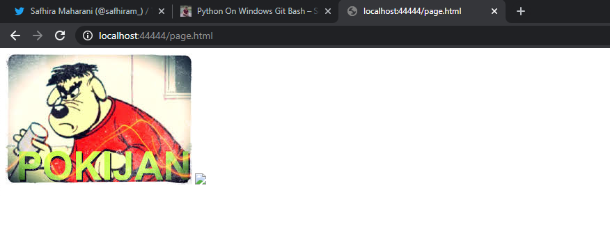

# Percobaan Code
## Jalankan runserver.sh yang akan menjalankan async_server.py pada port 9002, 9003, 9004, 9005

## Jalankan lb.py pada port 44444

## Buka http://localhost:44444/page.html

# Perbandingan Hasil
## server_async_http.py pada port 45000

## server_thread_http.py pada port 46000

## asyncronus server dengan load balance

