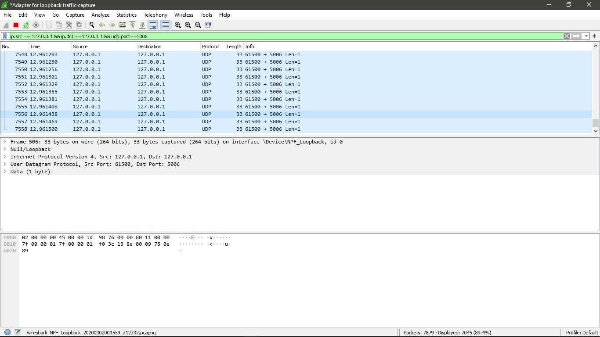
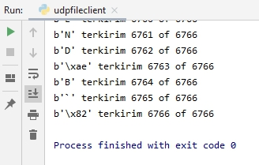
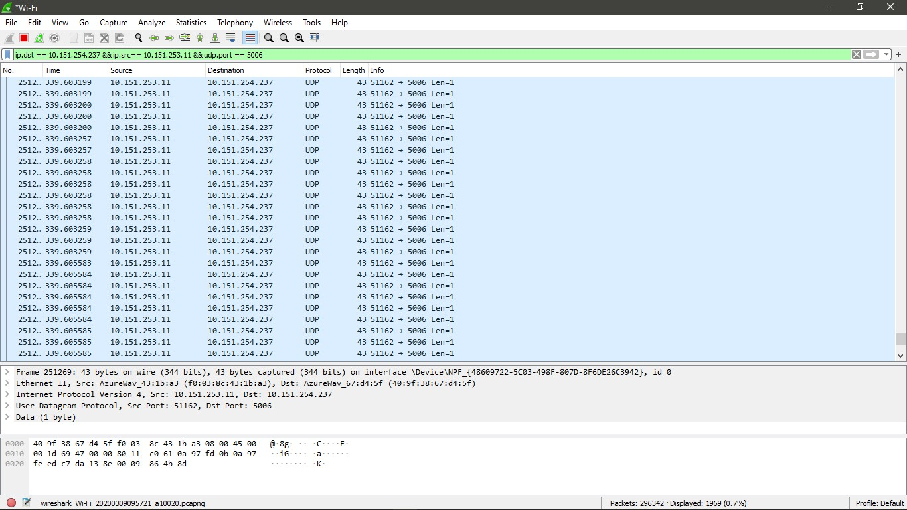
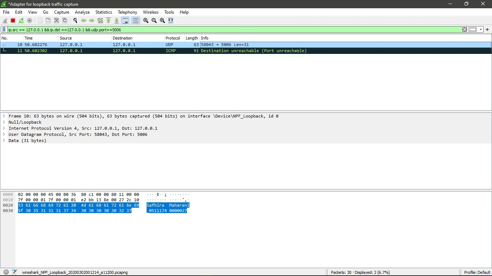
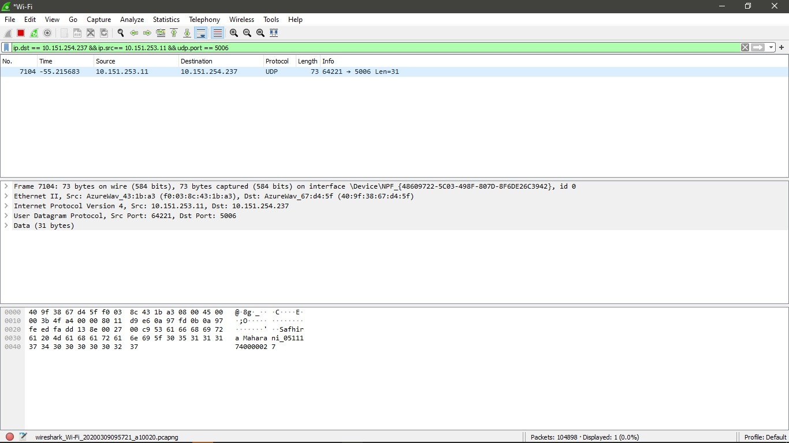

Safhira Maharani   05111740000027  

# Tugas 2
## Capture hasil keluaran dari program udpfileclient.py ke alamat 127.0.0.1 ke port 5006
1. modifikasi file udpfileclient.py dengan mengganti IP_Target menjadi 127.0.0.1 atau localhost dan IP_Port menjadi 5006
2. buka wireshark, setting interface menjadi 'Adaptor Loopback traffic capture', lalu pada filter isi dengan "ip.src == 127.0.0.1 && ip.dst ==127.0.0.1 && udp.port==5006" 
3. hasil capture

## Capture hasil keluaran dari program udpfileclient.py ke alamat 10.151.254.237 ke port 5006

1. modifikasi file udpfileclient.py dengan mengganti IP_Target menjadi 10.151.254.237  atau localhost dan IP_Port menjadi 5006
2. buka wireshark, setting interface menjadi 'Wifi', lalu pada filter isi dengan "ip.src == 10.151.254.237 && ip.dst== 10.151.253.11 && udp.port == 5006"
3. hasil capture

Bukti berjalan di komputer saya

Bukti berjalan di komputer lain

## Capture hasil keluaran dari program udp_simple.py ke alamat 127.0.0.1 ke port 5006

1. modifikasi file udp_simple.py dengan mengganti IP_Target menjadi 127.0.0.1 atau localhost dan IP_Port menjadi 5006
2. buka wireshark, setting interface menjadi 'Adaptor Loopback traffic capture', lalu pada filter isi dengan "ip.src == 127.0.0.1 && ip.dst ==127.0.0.1 && udp.port==5006" 
3. hasil capture

## Capture hasil keluaran dari program udp_simple.py ke alamat 10.151.254.237 ke port 5006

1. modifikasi file udp_simple.py dengan mengganti IP_Target menjadi 10.151.254.237  atau localhost dan IP_Port menjadi 5006
2. buka wireshark, setting interface menjadi 'Wifi', lalu pada filter isi dengan "ip.src == 10.151.254.237 && ip.dst== 10.151.253.11 && udp.port == 5006"
3. hasil capture

Bukti berjalan di komputer lain

