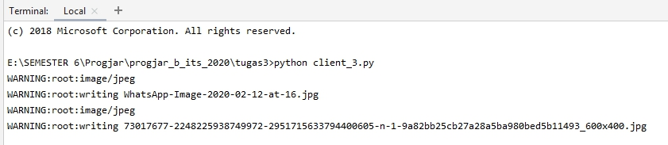

Safhira Maharani   05111740000027  

## Penjelasan
Thread adalah sebuah alur kontrol dari sebuah proses. Suatu proses yang multithread mengandung beberapa perbedaan alur kontrol dengan alamat yang sama.
Contoh kasus kita dapat mendownload file gambar dengan input berupa URL secara bersamaan.
Guna dari adanya thread ini dapat meningkatkan efisiensi waktu dan sumber daya.
 
Langkah-langkah:

* buat list url gambar
* buat thread untuk masing2 input pada fungsi yang sama yaitu download_gambar
* start thread yang ada pada list threads

## Hasil Request Download File menggunakan Thread

