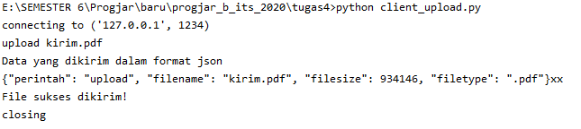

# Rancanglah sebuah protokol untuk

## Meletakkan File

### Langkah-langkah

* Masukkan input berupa nama file yang akan ditaruh ke server
* Buat data json yang berisi tentang perintah untuk meletakkan file, nama file, ukuran file dan tipe file
* Kirim data json ke server dari client
* Server menerima data json, langsung mengeksekusi sesuai dengan perintah nya yaitu upload
* Di dalam proses upload, server memanggil objek yang terbentuk dari class Person Machine untuk menghubungkannya ke class Person untuk menyimpan data file ke mydata.dir
* Open file untuk membuat file baru yang berisi data yang dikirim oleh client
* Jika data file dan berhasil disimpan akan menghasilkan string "OK"

### Bukti
* Saat menjalankan client_upload.py. Data dan perintah yang dikirim dalam bentuk json. Upload berhasil dengan mengirimkan file dari client ke server.



* Hasil dari server_thread_person.py yang berhasil menyimpan data file dan file, ditandai dengan output "OK"


* Data berhasil bertambah dalam mydata.dir


* Bukti bahwa file berhasil diupload


## Mengambil File

### Langkah-langkah

* Masukkan input berupa nama file yang akan didownload dari server
* Buat data json yang berisi tentang perintah untuk mendownload file, nama file
* Kirim data json ke server dari client
* Server menerima data json, langsung mengeksekusi sesuai dengan perintah nya yaitu download
* Di dalam proses download, server memanggil objek yang terbentuk dari class Person Machine untuk menghubungkannya ke class Person untuk mencari data file ke mydata.dir
* Open file untuk mengirim file ke client

### Bukti
* Saat menjalankan client_download.py. Data dan perintah yang dikirim dalam bentuk json. Download berhasil dilakukan.


* Hasil dari server_thread_person.py yang berhasil mencari data file dan file, ditandai dengan terkirimnya file yang direquest oleh client


* Bukti bahwa file berhasil didownload


## Melihat List File

### Langkah-langkah
* Buat data json yang berisi tentang perintah untuk melihat daftar list
* Kirim data json ke server dari client
* Server menerima data json, langsung mengeksekusi sesuai dengan perintah nya yaitu list
* Di dalam proses list, server memanggil objek yang terbentuk dari class Person Machine untuk menghubungkannya ke class Person untuk me return daftar data file yang ada dalam mydata.dir
* Server mengirimkan daftar tersebut ke client


### Bukti
* Saat menjalankan client_list.py. Data dan perintah yang dikirim dalam bentuk json.


Keterangan : Yang diberi kotak merah adalah data yang tersimpan di database pada saat upload. Yang lainnya adaah data dummy.

* Hasil dari server_thread_person.py yang berhasil me return daftar data file yang ada dalam mydata.dir


# Dokumentasi dari protokol

```
PROTOCOL FORMAT

KETENTUAN MEMBACA FORMAT
string terbagi menjadi 2 bagian, dipisahkan oleh spasi
COMMAND spasi PARAMETER ...

FITUR

- upload : untuk membuat file yang dikirim oleh client
  request : upload
  parameter : nama file
  response : berhasil -> OK
             gagal -> ERROR

- list : untuk melihat daftar record
  request: list
  parameter: tidak ada
  response: daftar file yang ada

- download : untuk mencari file berdasar nama yang akan dikirimkan ke client
  request: download
  parameter: nama file yang dicari
  response: file yang dicari

- jika command tidak dikenali akan merespon dengan ERRCMD
```

# Gunakan format JSON untuk tugas ini

<p> pada tugas ini sudah menggunakan format JSON, dapat dilihat dari screenshoot gambar diatas</p>
<p> Data file yang disimpan di dalam database juga dalam bentuk json </p>


# Buat client untuk setiap operasi tersebut

* Untuk operasi meletakkan file -> client_upload.py


* Untuk operasi mengambil file -> client_download.py


* Untuk operasi melihat list file -> client_list.py


