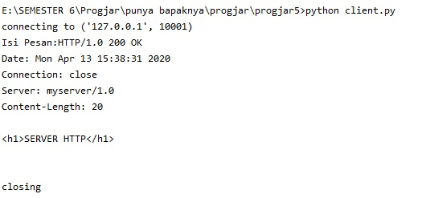
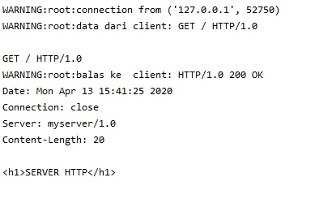

# Hasil Percobaan Pada client.py

## Hasil server pada saat menjalankan client

# Hasil Percobaan Pada Telnet

## Hasil server pada saat menjalankan telnet

# Hasil Percobaan Pada Browser

## Hasil server pada saat menjalankan browser

