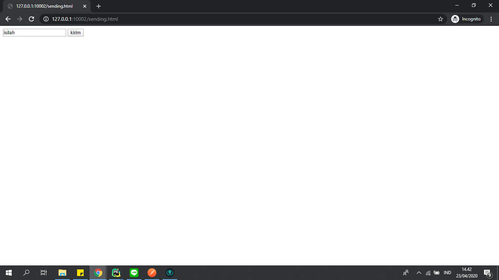
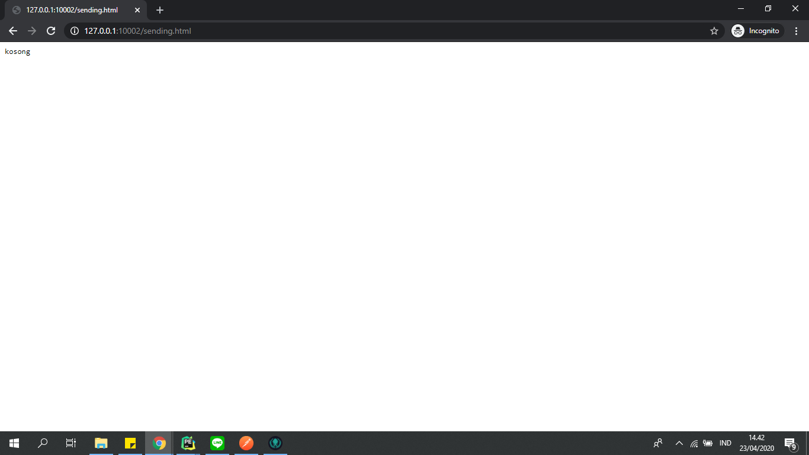
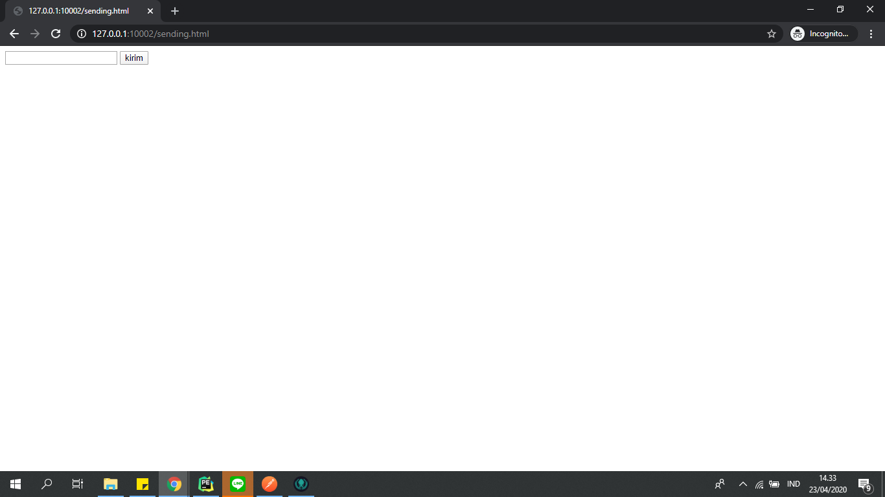
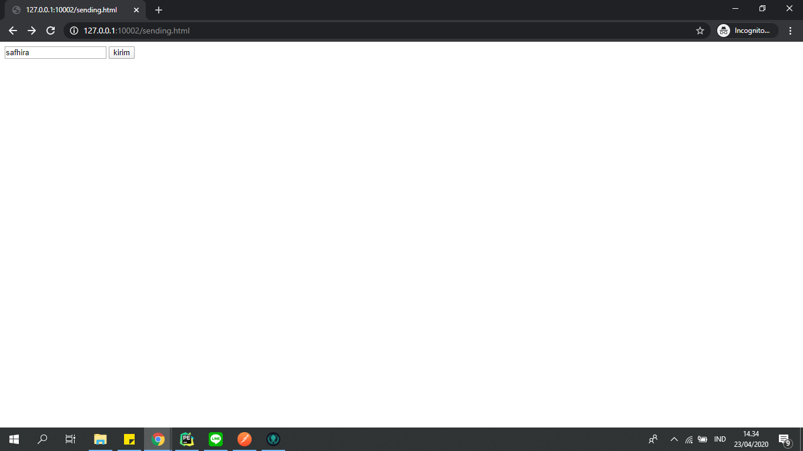
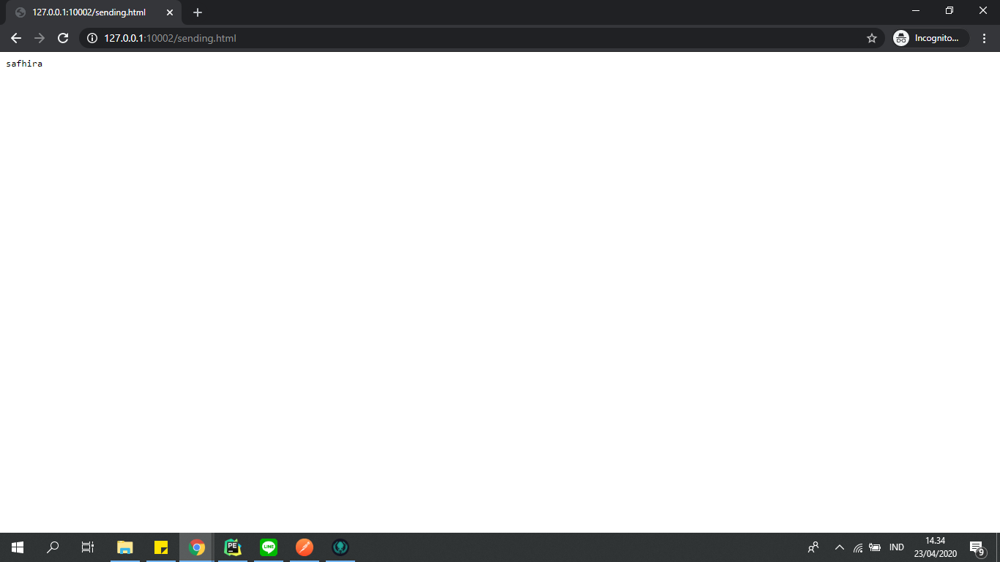

# POST : Sebelum dimodifikasi

* Bukalah http://127.0.0.1:10002/sending.html pada browser, akan muncul tampilan seperti ini:

* Isilah input tersebut, tekan tombol kirim, dan akan muncul tampilan seperti ini: 
Keterangan : Apapun inputnya, halaman akan tetap menampilkan tulisan kosong

# POST : Modifikasi

* Bukalah http://127.0.0.1:10002/sending.html pada browser, akan muncul tampilan seperti ini:

* Isilah dengan input apapun dan tekan tombol kirim

* Tulisan di halaman akan sesuai dengan input yang diisi

