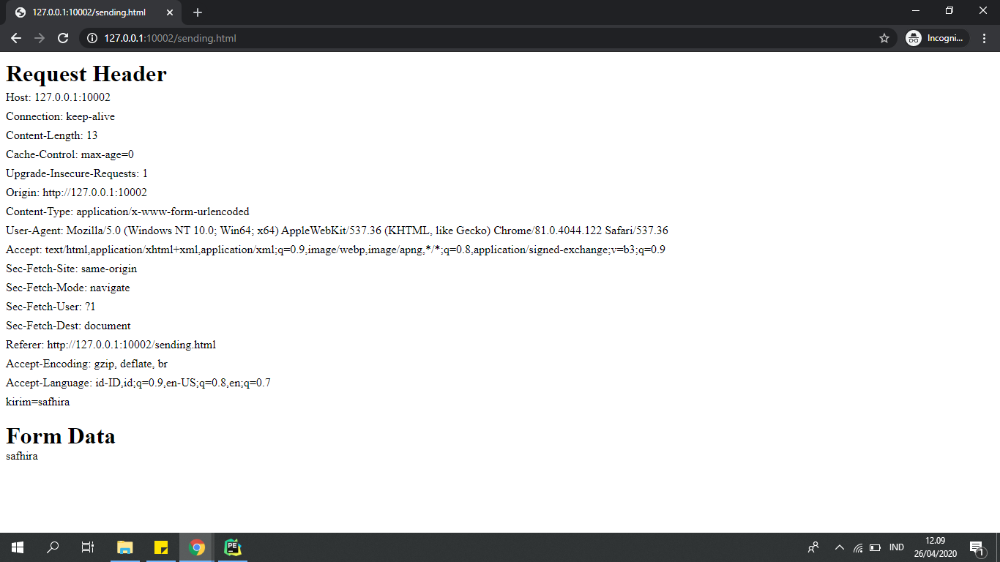
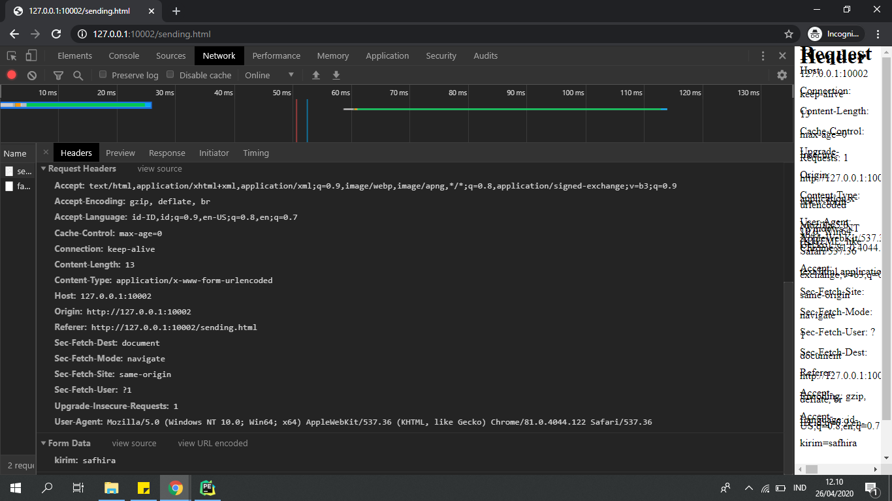

# POST : Sebelum dimodifikasi

* Bukalah http://127.0.0.1:10002/sending.html pada browser, akan muncul tampilan seperti ini:

* Isilah input tersebut, tekan tombol kirim, dan akan muncul tampilan seperti ini: 
Keterangan : Apapun inputnya, halaman akan tetap menampilkan tulisan kosong

# POST : Modifikasi

* Bukalah http://127.0.0.1:10002/sending.html pada browser, akan muncul tampilan seperti ini:

* Isilah dengan input apapun dan tekan tombol kirim

### Menampilkan semua  header yang dikirim dari browser

<strong>Keterangan :</strong> Berisi Request Header yang dikirim dari browser ke server

### Menampilkan sesuai dengan isi form seperti saat mengisi pada poin 5

<strong>Keterangan :</strong> Isi pada form sesuai dengan input yang diisikan pada halaman sebelumnya

