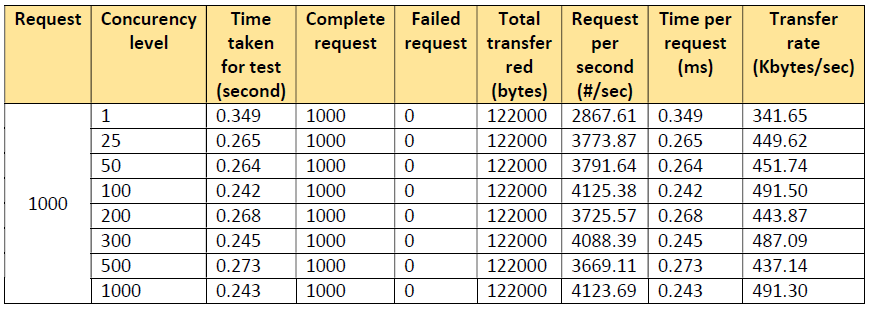
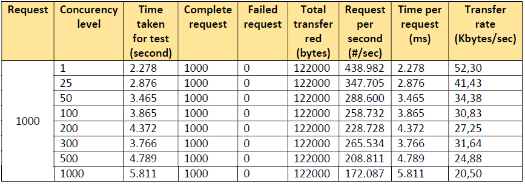

# Server Async

# Server Thread

# Kesimpulan

Dapat dlihat pada hasil performance test pada kedua macam server tersebut, server asynchronous 
lebih memiliki peforma yang lebih baik jika dibandingkan dengan server thread, maka dari itu server 
asynchronous bekerja lebih cepat daripada thread.

